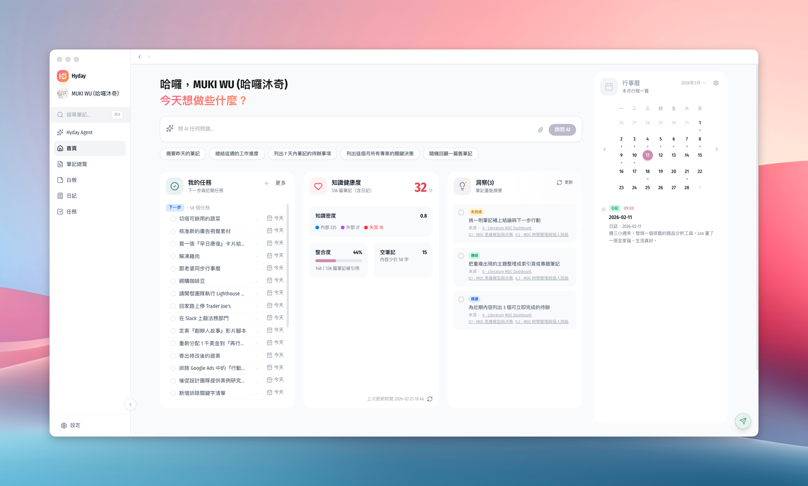

# Hyday

> Your Second Brain — 為深度思考者打造的桌面筆記應用

Hyday 整合筆記、日誌、任務與 AI 洞察，用你自己的方式組織知識。所有資料以 Markdown 檔案儲存在本地，不鎖定、不上傳、隨時帶走。

## 功能特色

### 雙向連結筆記
使用 `[[wiki-link]]` 語法建立知識圖譜，自動維護反向連結，讓每一則筆記都成為知識網絡的一部分。

### Life Log 日誌系統
獨創 5 種標記語法，用最少的按鍵記錄一天的故事：

| 語法 | 用途 |
|------|------|
| `>(時間) 文字` | 標記任務開始 |
| `<(時間) 文字` | 標記任務結束 |
| `-(時間) 文字` | 標記當前進行中 |
| `%(想法內容)` | 捕捉靈光一閃的想法 |
| `!(重要內容)` | 標記重要事項 |

### AI 智慧洞察
背景分析你的筆記與日誌，自動發現未完成事項、提煉想法、建議連結，讓 AI 成為你的第二大腦夥伴。

### 視覺白板
便簽、卡片、分組的無限畫布。用視覺化的方式整理思緒，支援拖放與連線。

### All-in-One 工作台
筆記、日誌、任務、白板——不再需要在多個 App 之間切換，讓知識自然流動。

## Local First — 你的資料，只屬於你

- **真正的檔案** — 所有筆記以 Markdown 格式儲存在你選擇的資料夾，隨時可用任何編輯器開啟
- **不怕被鎖定** — 不想用了？直接帶走你的檔案
- **隱私保障** — 筆記內容不會上傳到我們的伺服器

## 下載

請至 [GitHub Releases](https://github.com/mukiwu/hyday/releases) 下載最新版本。

App 已完成 Apple 簽名與公證，下載後可直接開啟使用。

## 自動更新

v0.6.0 起支援自動更新：App 會在背景檢查新版本，下載完成後發送系統通知，點擊即可重啟更新。

## 問題回報

如果使用上遇到任何問題或有建議，歡迎到 [Issues](https://github.com/mukiwu/hyday/issues) 回報。

## 官方網站

[hyday.web.app](https://hyday.web.app)
