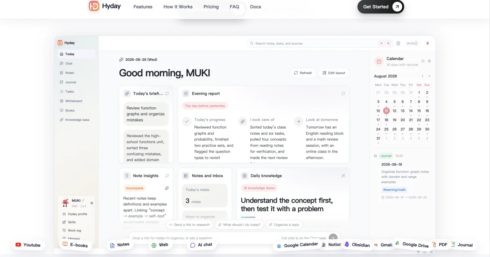

# Hyday

> 與 Hyday 一起打造你的個人知識庫

Hyday 是一款本地優先的 AI 個人知識庫秘書，將筆記、網頁、文件、日誌與行事曆連結在同一套工作流裡，幫助你整理知識、找回脈絡，並完成日常工作。

Hyday 是 macOS 與 Windows 桌面應用程式。你可以直接開啟自己的 Markdown 筆記資料夾，不必先把資料搬到雲端；需要 AI 時，再選擇自己信任的 AI 服務。

## 你可以用 Hyday 做什麼

### 先記下來，再讓脈絡回來

- 使用既有的 Markdown 筆記資料夾，不必改變原本的記錄習慣
- 寫筆記、日誌與 LifeLog，保留每天的工作與生活線索
- 收集網頁、PDF、文件與書摘，讓零散素材回到同一套工作流
- 透過搜尋、標籤、人事物與主題脈絡，找回曾經走過的路

### 從「今日」開始推進

今日頁把近期筆記、任務、日誌與閱讀脈絡放在一起，協助你確認今天的重點、回顧進度，並找到下一步。任務變更也能回寫到原始 Markdown，讓筆記與工作流程保持同步。

### 讓 Hyday Agent 在需要時工作

你可以在對話中請 Hyday 搜尋資料、整理來源、建立關聯或協助規劃。每次 AI 工作都依照功能選擇需要的資料與工具，並在需要讀取或寫入時讓你確認，不會把整個筆記資料夾預設交給 AI。

### 把想法排在一起

白板用便利貼、筆記指向與連線整理思緒，不複製另一份筆記全文。電子書、知識庫、思考視角與 Discord 連接也能依你的需要加入工作流。

## Local-first：資料由你保存

- 原始筆記、日誌與附件留在你選擇的筆記資料夾，仍是一般 Markdown 與檔案
- Hyday 的索引、記憶與功能狀態放在 `.hyday/`；知識庫衍生內容放在 `hyday-wiki/`
- 使用 AI 時，只會依照該次功能需要的來源、記憶與工具處理資料
- 使用本機 AI 時，內容留在自己的電腦；使用雲端 AI 或外部服務時，資料會依你的設定送到選定的服務

詳細說明請參考[資料落點與 AI 邊界](https://hyday.tw/docs/data-boundaries)。

## 開始使用

1. 從 [GitHub Releases](https://github.com/mukiwu/hyday/releases/latest) 下載 Hyday
2. 開啟應用程式，選擇既有的筆記資料夾或建立新的資料夾
3. 直接寫下第一篇筆記；需要時再安裝 [Hyday Capture](https://chromewebstore.google.com/detail/hyday-capture/iledkgijiifoddhgipghafnidgfjncac?hl=zh-TW) 或設定 AI 服務

目前提供 macOS Apple Silicon（M1 以上）與 Windows x64 版本；不支援 Intel Mac。macOS 版本已完成 Apple 簽名與公證，下載後可直接開啟使用。

## 核心功能免費使用

免費版包含筆記、日誌、Markdown、白板、習慣追蹤、任務、LifeLog 與 Hyday AI Agent，也能選用 Discord 與瀏覽器擷取等工作流。

VVIP 再提供進階角色與圓桌討論、影片時間軸筆記、EPUB 閱讀與 AI 雙語翻譯、無限雲端分享，以及 VVIP Discord 頻道等功能。詳情請見[官方網站方案說明](https://hyday.tw/#pricing)。

## 文件

- [Hyday 文件首頁](https://hyday.tw/docs)
- [安裝 Hyday](https://hyday.tw/docs/install)
- [選擇或建立筆記資料夾](https://hyday.tw/docs/choose-a-vault)
- [建立第一篇筆記](https://hyday.tw/docs/create-first-note)
- [筆記與可攜 Markdown](https://hyday.tw/docs/notes-and-markdown)
- [日誌與 LifeLog](https://hyday.tw/docs/journal-and-lifelog)
- [任務與 Markdown 回寫](https://hyday.tw/docs/tasks)
- [Hyday Agent：對話、工具與確認](https://hyday.tw/docs/hyday-agent)
- [技能與工具](https://hyday.tw/docs/skills-and-tools)
- [書籍與閱讀](https://hyday.tw/docs/books)
- [資料落點與 AI 邊界](https://hyday.tw/docs/data-boundaries)

## 自動更新

Hyday 會在背景檢查最新穩定版本；下載完成後通知你，再由你決定何時重新啟動套用更新。

## 問題回報

遇到問題或有功能建議，歡迎到 [GitHub Issues](https://github.com/mukiwu/hyday/issues) 回報。

更多產品介紹與使用情境，請前往 [hyday.tw](https://hyday.tw)。
